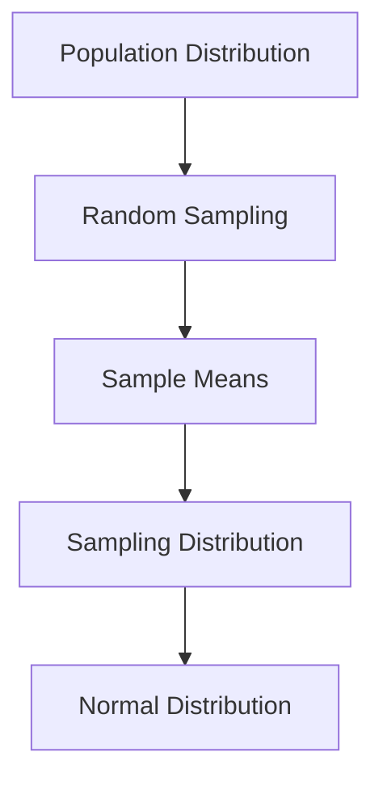

The Central Limit Theorem is a fundamental concept in probability theory and statistics. It states that, given certain conditions, the distribution of sample means approximates a normal distribution as the sample size becomes larger, regardless of the underlying distribution of the population.

## Key Points

- Applies to independent and identically distributed random variables
- Sample size should be sufficiently large (typically n ≥ 30)
- The mean of the sampling distribution equals the population mean
- The standard error of the mean decreases as sample size increases

## **Applicability of the Central Limit Theorem**

- When the probability distribution of X is normal, the distribution of $\bar{X}$ is exactly normally distributed regardless of sample size
- When the probability distribution of X is symmetrical, the CLT applies very well to small sample sizes (often as small as 10 ≤ n ≤ 25)
- When the distribution of X is asymmetrical, the approximation to a normal distribution becomes more accurate as n becomes large

Generally, a good convergence of the sample mean distribution to a normal distribution can be achieved with a sample size of 25 or more.

## Importance in Statistics and Data Science

The Central Limit Theorem is crucial in various fields, including:

- Statistical inference and hypothesis testing
- Constructing confidence intervals
- Data analysis and interpretation in research
- Machine learning algorithms and model evaluation

## Mathematical Formulation

For a sample mean X̄ from a population with mean μ and standard deviation σ:

$$
Z = \frac{\bar{X} - \mu}{\sigma / \sqrt{n}} \sim N(0,1)
$$
 
```latex
Z = \frac{\bar{X} - \mu}{\sigma / \sqrt{n}} \sim N(0,1)
```

Where n is the sample size, and Z follows a standard normal distribution as n approaches infinity.

## Visualizing the Central Limit Theorem



This diagram illustrates how the sampling distribution of means approaches a normal distribution, regardless of the original population distribution.

## Applications

The Central Limit Theorem has wide-ranging applications in various fields:

- Finance: Risk assessment and portfolio management
- Quality Control: Process monitoring and improvement
- Social Sciences: Survey analysis and population studies
- Medicine: Clinical trials and drug efficacy studies

Understanding and applying the Central Limit Theorem is essential for anyone working with data analysis, statistics, or machine learning.